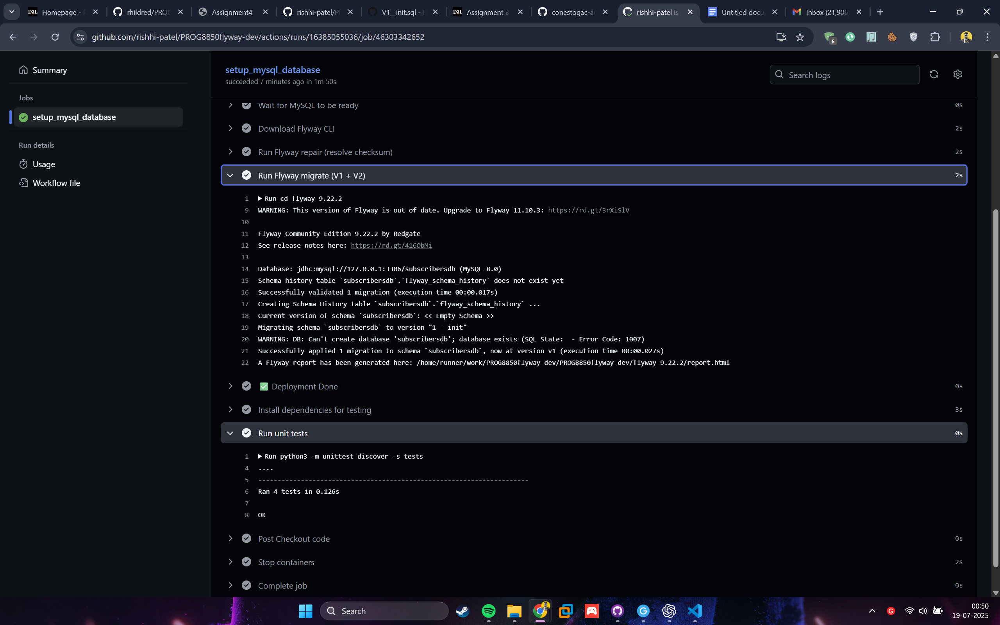

# Assignment 4 - PROG8850: Database Automation

**Student Name:** Rishikumar Patel
**Student ID:** 8972657

---

## 📘 Overview

This assignment demonstrates the use of **Flyway** and **GitHub Actions** for automating database migrations, along with **Ansible playbooks** for MySQL setup and teardown. The application manages a simple subscribers database and validates schema changes through automated unit tests.

---

## 📁 Project Structure

```
├── .github/workflows/flyway.yml       # GitHub Actions CI pipeline
├── flyway/sql/                        # V1 and V2 migrations
│   ├── V1__init.sql                   # Initial DB & table setup
│   └── V2__add_name_column.sql       # Schema evolution: add `name` column
├── tests/test_subscribers.py         # Unit tests (CRUD)
├── up.yml                             # Ansible playbook for setup
├── down.yml                           # Ansible playbook for teardown
```

---

## ⚙️ Flyway Migrations

Migrations are managed using [Flyway](https://flywaydb.org/):

- **V1\_\_init.sql** creates the `subscribers` table
- **V2\_\_add_name_column.sql** adds a `name` column to it

Migrations are triggered in CI using the Flyway CLI.

---

## 🧪 Unit Tests

Python's `unittest` framework is used to perform:

- Insert, Read, Update, Delete operations on the `subscribers` table
- Each test manages its own data to ensure isolation and reliability

Tests are run automatically as part of the GitHub Actions pipeline.

---

## 🐳 Ansible + Docker Setup

- **`up.yml`**: Brings up a MySQL container using Docker Compose and installs dependencies
- **`down.yml`**: Cleans up the environment by stopping and removing the container

---

## 🚀 GitHub Actions CI Workflow

Each push to the repository triggers the following:

1. Start MySQL using GitHub Actions services
2. Wait for MySQL to be ready
3. Download and run Flyway CLI
4. Run Flyway repair (to fix checksum issues)
5. Apply both V1 and V2 migrations
6. Run unit tests using `unittest`

All steps are green ✅ in the Actions tab as shown in the attached screenshot.



---

## 📝 How to Reproduce

1. Run the Ansible playbook:

```bash
ansible-playbook up.yml
```

2. To tear down:

```bash
ansible-playbook down.yml
```

**Rishikumar Patel – 8972657**
